# RFC-004A — Flight Deck Visual Review

**Status:** review pack for RFC-004 (pre-merge). No code was changed to
produce this document.

**How it was generated.** Every screenshot is the real implementation
(working tree at commit `171f8b3` + the uncommitted RFC-004 change),
rendered server-side against synthetic event logs seeded through
Foundry's public write APIs (the Parker-Brads fixture plus Missions,
Decisions, Outcomes, Reviews, and Claims written one event at a time).
Screenshots were captured with headless Chrome at native CSS-pixel
sizes: desktop 1280, tablet 768, mobile 375. The only post-processing
is cropping. Two screenshot-only HTML variants exist (drawer checked
open; keyboard focus placed after load) because a static capture
cannot press <kbd>Tab</kbd> — the pages themselves are unmodified.

All figures live in [`rfc-004-visual-review/`](rfc-004-visual-review/).

---

## 1. Desktop — Flight Plan states

### 1.1 NOMINAL

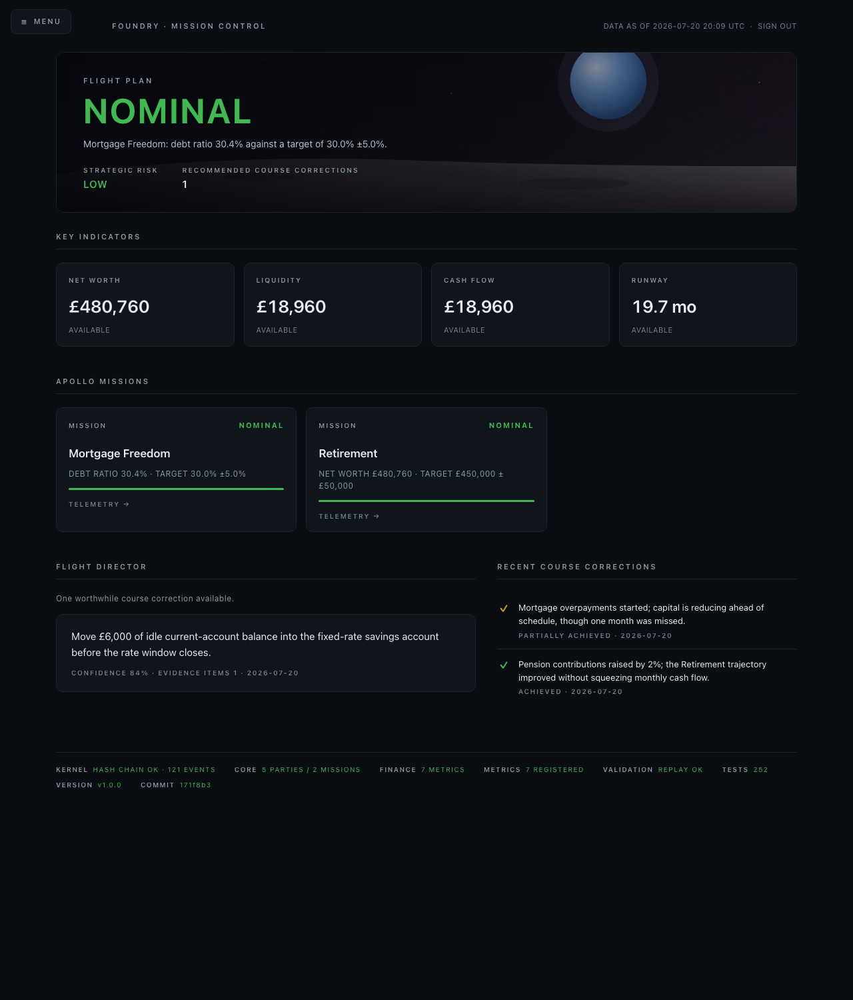

**What's working**
- The eye lands on one word, and the word answers the first question.
  Everything else on the page is visibly subordinate to it.
- The "why" line under the status word is a real sentence with real
  numbers ("Mortgage Freedom: debt ratio 30.4% against a target of
  30.0% ±5.0%") — reassurance with evidence, not a slogan.
- Strategic Risk and the course-corrections count complete the triage
  in a single glance band; nothing below the hero is required reading.

**What's distracting**
- Liquidity and Cash Flow both read £18,960 side by side. It is a
  fixture coincidence (every flow in this dataset touches a liquid
  account), but adjacent identical numbers *read like a rendering bug*
  to a reviewer, and Cash Flow carries no period qualifier — the value
  is net flow since first observation, which the card doesn't say.
- The lunar surface picks up a pale wash toward the right edge of the
  hero that reads as a smudge on large monitors rather than terrain.

**Recommended changes**
- Add a quiet period qualifier to the Cash Flow card sub-label (e.g.
  "SINCE FIRST OBSERVATION") — a label, not a new metric.
- Darken the top stop of the moon gradient a step so the surface stays
  matte across its full width.

### 1.2 WATCH

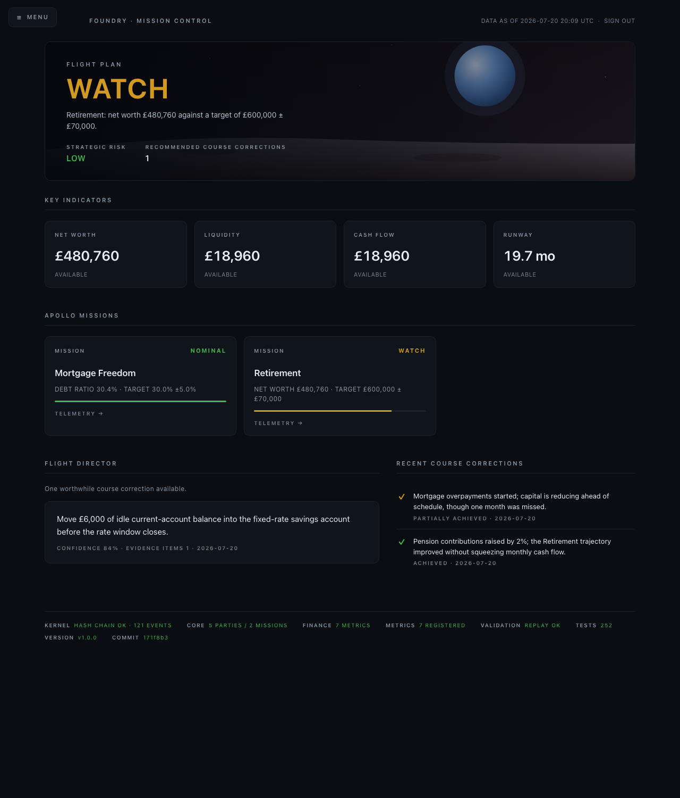

Close-up of the hero and the mission row in this state:

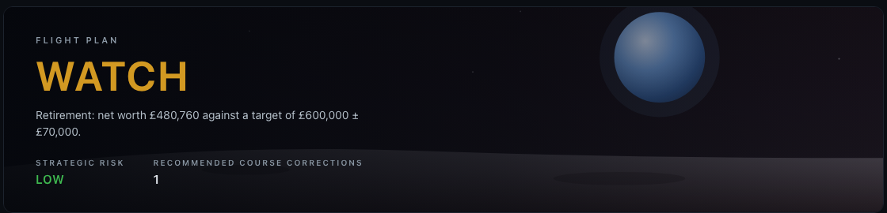
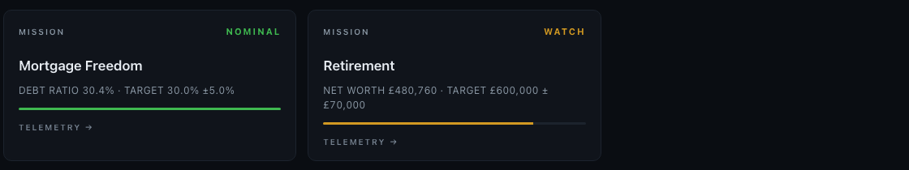

**What's working**
- Worst-status-wins is legible: one mission NOMINAL, one WATCH, and the
  hero takes the worse word — the aggregation logic is visible without
  being explained.
- The "why" line switches to the mission that *caused* the WATCH, so
  the second question is answered by the same glance that raised it.
- Amber is used exactly twice below the hero (card status, progress
  bar) — the alert level rises without the page becoming noisy.

**What's distracting**
- The amber progress bar under Retirement stops at ~80% of the track;
  the grey remainder slightly reads as "loading" rather than "short of
  target" at a glance.

**Recommended changes**
- Consider a small variance annotation at the bar's end ("−£119,240")
  so the gap is quantified where the eye already is.

### 1.3 OFF COURSE

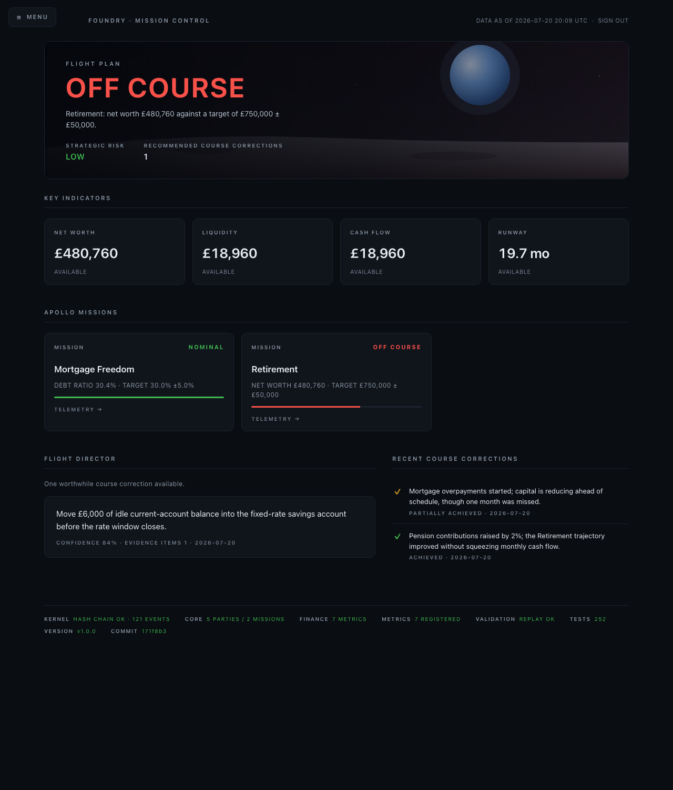

**What's working**
- The red is confined to the status word, one card badge, and one bar —
  an off-course page that still feels like a control room, not an
  alarm. This is the Constitution's "calm over activity" under the
  worst condition, and it holds.
- The Flight Director's single recommendation sits directly under the
  red state as the obvious next read: on course → why not → what to do.

**What's distracting**
- The recommendation shown (a savings-rate housekeeping move) is
  unrelated to the mission that is off course. It is honest — it is the
  latest standing recommendation — but under a red banner the reader
  expects the correction to address the deviation.

**Recommended changes**
- When Flight Plan is WATCH/OFF COURSE, prefer a recommendation whose
  claim concerns the deviating mission's subject, falling back to the
  latest otherwise. (Selection order only; same evidence path.)

---

## 2. Tablet — homepage (768)

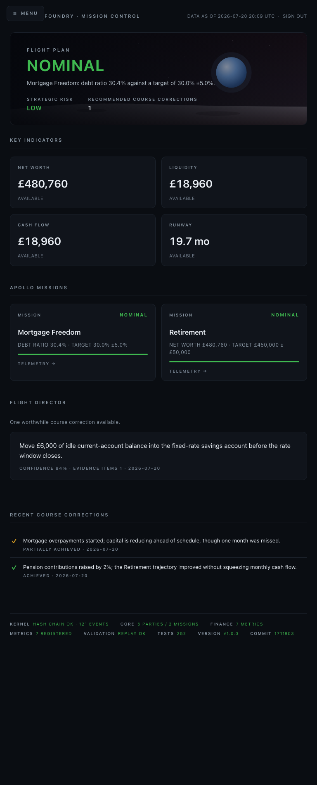

**What's working**
- The 2×2 KPI grid keeps all four indicators above the fold; the page
  reads as designed, not as a squeezed desktop.
- Flight Director and Course Corrections stack in a sensible order —
  the action item comes before the history.

**What's distracting**
- At exactly 768px the MENU pill clips the first letters of the
  "FOUNDRY · MISSION CONTROL" crumb — the small-screen breakpoint
  (760px) misses tablet portrait by 8 pixels.

**Recommended changes**
- Move the crumb-hiding breakpoint from 760px to ~820px.

---

## 3. Mobile (375)

| Homepage (full page) | Drawer closed (viewport) | Drawer open |
|---|---|---|
| 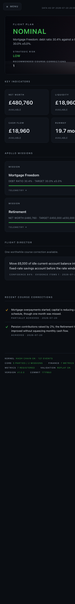 | 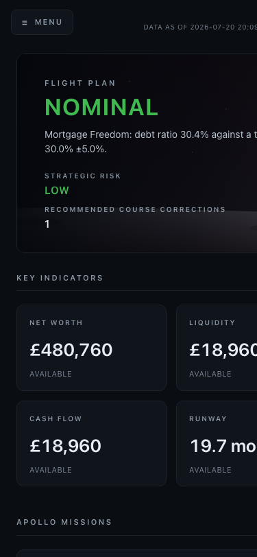 | 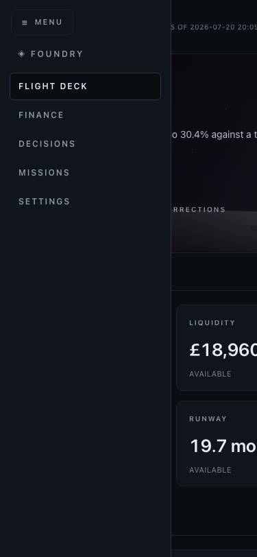 |

**What's working**
- The first viewport-full is the entire hero: status word, why-line,
  risk, and corrections count all fit above the fold on a 375×812
  screen. The three questions survive the smallest device.
- The drawer is a true slide-over: content position is preserved
  underneath and the MENU control stays put as the close affordance.

**What's distracting**
- The open drawer sits over an undimmed page; at this width the
  right-hand sliver of content competes slightly with the menu.
- One KPI card per two thumbs of scrolling makes the mobile page long;
  the KPI grid could tolerate 2-up down to ~360px.

**Recommended changes**
- Add a scrim behind the open drawer on small screens.
- Let the KPI grid stay 2-up on mobile (drop the 420px single-column
  step, or move it lower).

---

## 4. Mission detail — Mortgage Freedom drill-down

There is deliberately no dedicated Mission page yet (`/missions` is an
honest placeholder per RFC-003); a mission card's TELEMETRY affordance
drills into its **target metric's** telemetry page, which carries the
hero-to-evidence journey:

1. **Hero** — Flight Plan NOMINAL, why-line citing Mortgage Freedom
   (see §1.1).
2. **KPI row** — the same four registry-fed cards.
3. **Mission telemetry** — the Mortgage Freedom card: status badge,
   `DEBT RATIO 30.4% · TARGET 30.0% ±5.0%`, progress bar, TELEMETRY →.
4. **Evidence link** — the card links to `/metrics/finance.debt_ratio`
   (below), where every input event is enumerated.
5. **Flight Director** — the standing recommendation panel (see §6).

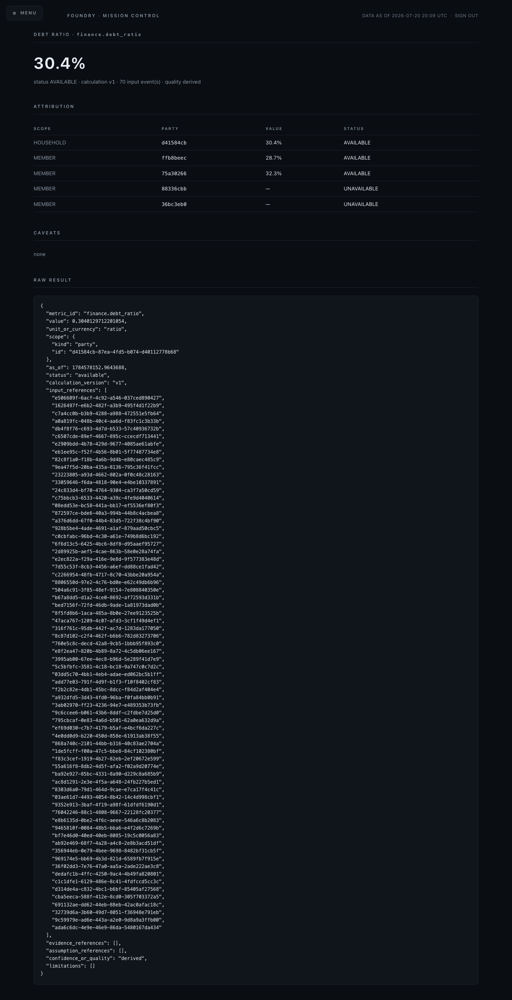

**What's working**
- The telemetry page is uncompromisingly evidence-first: headline,
  per-member attribution, caveats ("none" is stated, not omitted), and
  the raw MetricResult with all 70 input event references.
- The attribution table honestly shows two members UNAVAILABLE (the
  children own nothing) instead of hiding rows or inventing zeros.

**What's distracting**
- Party IDs are shown as raw 8-hex prefixes; a reviewer cannot tell
  which member is which without leaving the page.
- 70 raw UUIDs in a JSON block is proof, not communication — it earns
  trust on first visit and is skimmed past forever after.

**Recommended changes**
- Show party display names (with the ID as secondary text) once a
  naming surface exists.
- Collapse `input_references` behind a `<details>` disclosure with a
  count in the summary line.

## 5. Evidence chain — Flight Deck → Mission → Metric → Evidence → Event

The chain demonstrated end to end with real identifiers from the
review dataset:

1. **Flight Deck** hero: "Mortgage Freedom: debt ratio 30.4% against a
   target of 30.0% ±5.0%."
2. **Mission** card TELEMETRY → `/metrics/finance.debt_ratio`.
3. **Metric** page headline `30.4%`, `calculation v1`, `70 input
   event(s)`, per-member attribution.
4. **Evidence**: `RAW RESULT → input_references[0] =`
   `e506609f-6acf-4c92-a546-037ced890427`.
5. **Underlying event**, verbatim from the append-only log (hash-chained
   to its predecessor):

```json
{
  "actor": "user",
  "hash": "685a381f5a7aad33448abbdf73970ccd02cb90391b28fb57e0de59454bc9d5fc",
  "id": "e506609f-6acf-4c92-a546-037ced890427",
  "kind": "finance.account.declared",
  "payload": {
    "account_type": "checking",
    "currency": "GBP",
    "entity_id": "970ab1ba-11f2-4621-b6c5-841d5a270b5f",
    "liquidity_classification": "liquid",
    "name": "Joint current account",
    "tax_wrapper": "none"
  },
  "prev_hash": "e2203b25785733d9fc2fa589d7811b3e5a10aae0cc1a9140b820d8d047929e3e",
  "ts": 1784578152.9543018
}
```

Steps 1–4 are all in-product. Step 5 currently requires reading the
log file — there is no event-inspector page. The UI *reflects* the
evidence-first architecture faithfully up to the last hop; the last
hop is a known limitation (§10), not a broken promise: the event id on
the metric page is the exact id in the log.

---

## 6. Flight Director & Recent Course Corrections

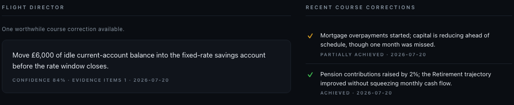

**Mission Control or chatbot?** Mission Control — for specific,
checkable reasons:

- **It is not conversational.** No first person, no "I noticed", no
  question back to the user, no invitation to continue a dialogue. One
  declarative lede ("One worthwhile course correction available."), one
  imperative statement, and a provenance line.
- **It shows its instruments.** `CONFIDENCE 84% · EVIDENCE ITEMS 1 ·
  2026-07-20` is the language of telemetry, not of a assistant's
  opinion. A chatbot asserts; this cites.
- **It is bounded.** Exactly one recommendation, by contract, and the
  no-action state is a positive statement ("Flight Plan remains
  nominal. No intervention required.") rather than an empty feed — a
  system reporting status, not a model waiting for a prompt.

The one chatbot-adjacent risk: the recommendation statement is
free-text prose from a Claim, so its voice depends on whoever (or
whatever) authored the claim. If model-derived claims later arrive in
first person, this panel will start sounding like a chat message.
Worth a style rule for claim statements ("imperative, no first
person") in a future authoring surface.

**Recent Course Corrections** — the ✓ / verdict / date rhythm is right
(disciplined history, not a win feed), and `PARTIALLY ACHIEVED` in
amber is honest where a "wins" panel would have rounded up. The
RFC-004 example format (`+12 days` of trajectory improvement) is not
implementable yet — no metric exists that expresses a review as a
trajectory delta, and inventing one was out of scope.

---

## 7. Navigation states

| Collapsed | Expanded / hover | Keyboard focus |
|---|---|---|
|  | 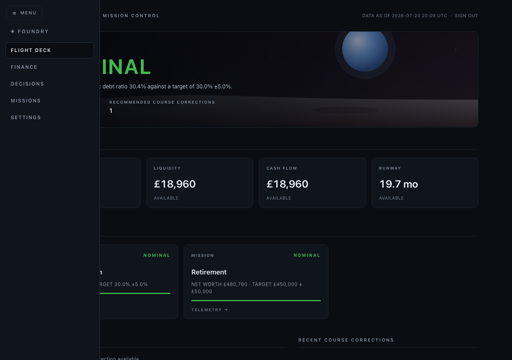 | 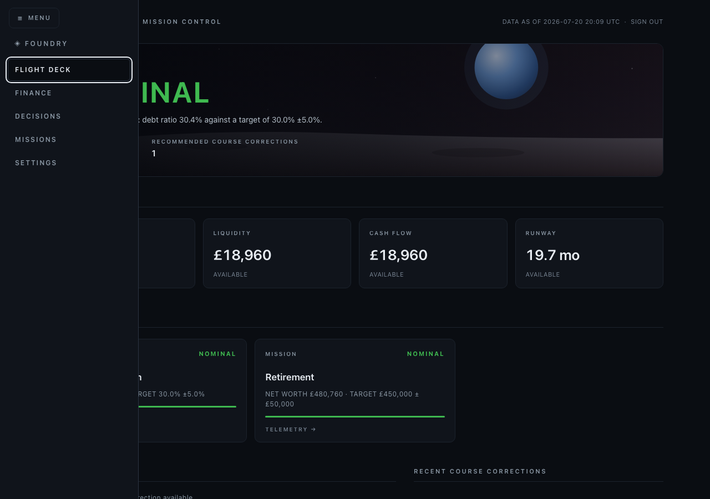 |

- **Collapsed** is the default everywhere: one MENU pill, full content
  width — the RFC's "maximise content space" is real.
- **Hover** (desktop ≥900px) reveals the same drawer as clicking; the
  two states are visually identical, so one screenshot covers both.
- **Keyboard focus**: the white 2px ring on FLIGHT DECK is
  unmistakable against the panel (§9). Tabbing keeps the drawer open
  (`:focus-within`); closing it returns focus flow to the page.
- The active page is marked with a filled border *and*
  `aria-current="page"` — state is not color-only.

**What's distracting**
- The drawer has no close "×"; MENU-as-toggle works but first-time
  users may hunt. (The Escape key does nothing — a zero-JS constraint.)

---

## 8. Empty states

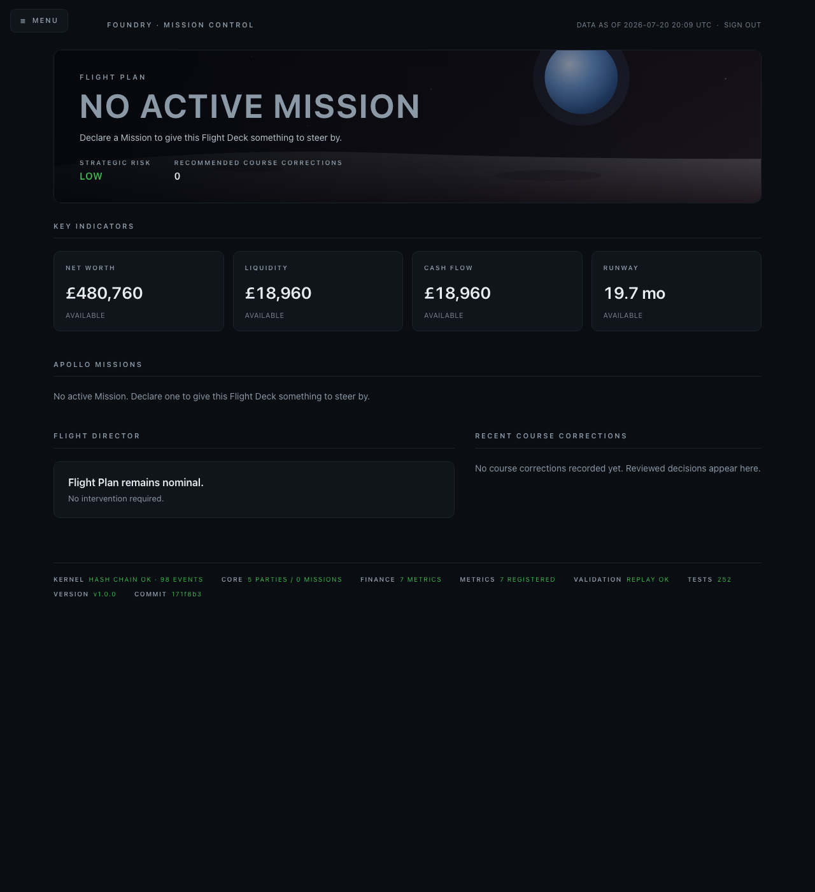

One state covers all three empties honestly:

- **No Missions** → the hero says `NO ACTIVE MISSION` in neutral
  grey-blue (not red — absence is not failure) and tells the user the
  one thing that would change it: "Declare a Mission to give this
  Flight Deck something to steer by."
- **No Recommendation** → the Flight Director *states* "Flight Plan
  remains nominal. No intervention required." — the RFC's explicit
  no-action requirement, verbatim on screen.
- **No Course Corrections** → "No course corrections recorded yet.
  Reviewed decisions appear here." — explains what the panel is *for*
  instead of showing a bare gap.

The mission-active-but-nothing-to-do variant renders the same calm
Flight Director panel under a green NOMINAL:
[`empty-no-action.png`](rfc-004-visual-review/empty-no-action.png).

**What's distracting**
- `RECOMMENDED COURSE CORRECTIONS 0` in the hero duplicates what the
  Flight Director already says more gracefully below.

---

## 9. Accessibility

| Keyboard focus (nav) | Keyboard focus (content) | 200% zoom | Reduced motion |
|---|---|---|---|
|  | 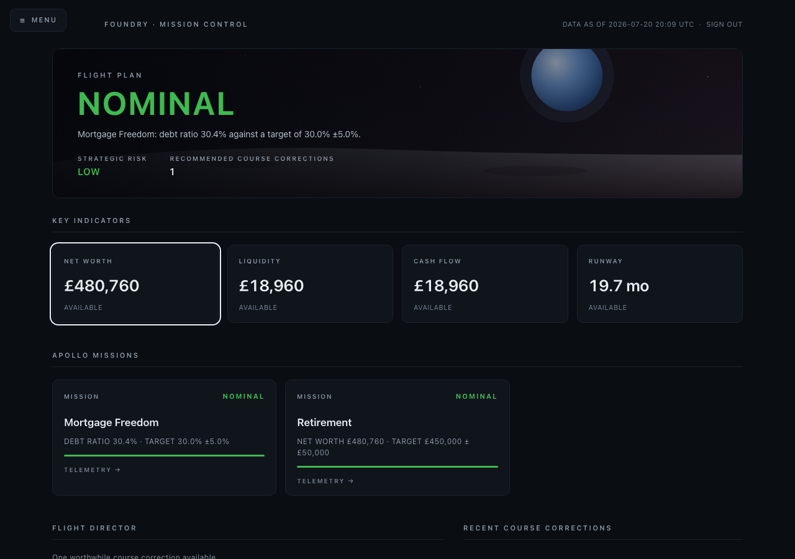 | 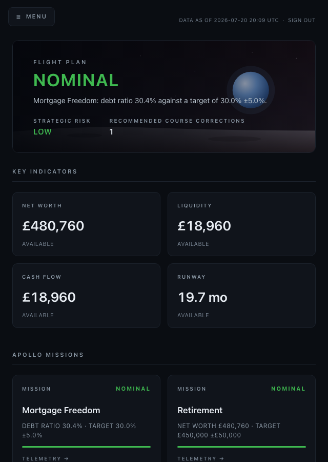 |  |

- **Keyboard navigation**: skip-link first, then MENU toggle
  (space/enter opens), drawer links, then content cards in DOM order.
  Every interactive element is a real `<a>`/`<input>` — no synthetic
  click targets.
- **Focus indicators**: 2px text-color outline with 2px offset on
  every focusable element; visible on both panel and card backgrounds
  in the shots above.
- **200% zoom** (640px layout viewport): the page reflows to the
  tablet arrangement — no horizontal scrolling, no clipped text, KPI
  values still tabular and legible.
- **Reduced motion**: the drawer's slide transition is removed under
  `prefers-reduced-motion`; since RFC-004 ships no other animation,
  the reduced-motion capture is intentionally identical to the normal
  open state — that *is* the pass condition.
- Status is never color-only (word + color everywhere); the decorative
  Earthrise SVG is `aria-hidden`; the data table on telemetry pages is
  a real `<table>` with `<th>` headers.

Not yet verified: a real screen-reader pass (VoiceOver/NVDA) — listed
in §10.

---

## 10. Responsive review — side by side

| Desktop 1280 | Tablet 768 | Mobile 375 |
|---|---|---|
|  |  |  |

The three breakpoints are the same page with the same hierarchy — the
hero never loses a line, the KPI grid steps 4 → 2 → 1, and the
duo panels stack below 900px. Nothing is desktop-only.

---

## 11. Overall design evaluation

**Calm / In Control / Confident / Curious**

- **Calm — achieved.** Dark, matte, one accent color per state, no
  motion at rest, generous whitespace. Even OFF COURSE stays quiet.
- **In Control — achieved.** The hero triage band (status, why, risk,
  action count) reads like an instrument cluster; the footer's live
  system-health line (hash chain, replay parity, test count) extends
  the feeling to the machine itself.
- **Confident — achieved**, chiefly through honesty: UNAVAILABLE where
  data is missing, "none" under caveats, explicit no-action statements.
  Nothing hedges and nothing decorates.
- **Curious — partially.** TELEMETRY → and the KPI cards invite one
  drill-down hop, and the telemetry page rewards it. But the chain
  visibly ends at a JSON block; curiosity currently terminates in raw
  UUIDs rather than another satisfying layer.

**The five-second test** — *Am I on course? Why? Do I need to do
anything?* **Pass on desktop and mobile.** The status word is readable
from across a room; the why-line and corrections count are inside the
same visual block; no scrolling is needed on any tested viewport. The
one qualification: "Recommended Course Corrections: 1" tells you *that*
there is something to do — you scroll one screen to learn *what*. That
matches the RFC's intent (the hero is triage, not the briefing), but
it is the five-second boundary.

## 12. Earthrise assessment

- **Does it feel premium?** At arm's length, yes — the restraint (dim
  stars, matte lunar band, one lit sphere) reads as intentional and
  sits behind the type without fighting it. Under scrutiny the Earth
  is recognisably a gradient-filled circle: the low-opacity halo reads
  as a drawn ring rather than atmosphere, and there is no terminator
  or surface detail. Premium-adjacent; not yet iconic.
- **Does it become distracting?** No. In twelve screens of use it
  never competes with the status word — the scrim gradient keeps the
  text side authoritative. The only blemish is the pale wash on the
  right of the lunar surface (§1.1).
- **Should it eventually be replaced with a real Earthrise image?**
  Yes — the Design Constitution calls the Earthrise *the* visual
  identity, and identity deserves the photograph (NASA AS8-14-2383 is
  public domain). That is a deliberate later step: a static asset
  route plus `img-src 'self'` in the CSP, with the SVG kept as the
  zero-request fallback. The SVG was the right call for RFC-004's
  no-new-attack-surface constraint.
- **More or less vertical space?** Neither. At ~300px the hero carries
  the triage band and still leaves the full KPI row above the fold on
  a 13" laptop. Taller would cost the KPI row its above-fold seat for
  pure scenery; shorter would crowd the status word against the stats.

## 13. Apollo Missions assessment

- **Information density — right.** Five elements per card (label,
  status, name, one metric line, affordance); nothing requires reading
  order instructions. Two cards side by side scan in under a second.
- **Progress presentation — one honest flaw.** `DEBT RATIO 30.4% ·
  TARGET 30.0% ±5.0%` is the RFC's "no meaningless percentages" done
  right. But the bar encodes `value ÷ target`, which assumes *higher
  is better*: Mortgage Freedom (a lower-is-better metric) shows a full
  green bar at 101% of its debt-ratio target — correct status, wrong
  metaphor. If debt rose to 40%, the bar would *fill further* while
  the status went red.
- **Status visibility — strong.** The colored word sits top-right at a
  fixed position on every card; a row of cards can be triaged
  peripherally, and word+color survives monochrome.
- **Scanability — strong**, helped by worst-status-wins agreement
  between cards and hero: the page never says two different things.

*(Critique only — the bar-direction issue is recorded in §15, not
fixed.)*

## 14. Consolidated recommended changes

Ordered by value-for-effort; all are presentation-layer and none
block RFC-004 in this reviewer's view. **No code was changed for any
of these.**

1. Make mission progress bars direction-aware (or omit the bar when
   the target is a lower-is-better metric) — §13.
2. Add a period qualifier to the Cash Flow KPI sub-label — §1.1.
3. Prefer a deviation-relevant recommendation in the Flight Director
   when the Flight Plan is WATCH/OFF COURSE — §1.3.
4. Widen the small-screen crumb breakpoint to cover 768px tablet
   portrait — §2.
5. Collapse `input_references` behind a disclosure on telemetry pages;
   show member names when a naming surface exists — §4.
6. Add a scrim behind the mobile drawer; keep KPI cards 2-up on
   mobile — §3.
7. Soften the right-hand wash on the lunar surface — §1.1.
8. Drop the "0" corrections stat from the hero when the Flight
   Director already states no action — §8.

## 15. Known limitations (documented, not fixed)

- **No Mission detail page.** Mission cards drill into their target
  metric's telemetry; `/missions` remains an RFC-003 placeholder. The
  RFC-004A "Mission Detail" section is therefore the metric journey.
- **Evidence chain's last hop is off-screen.** Event ids are shown and
  real, but inspecting an event requires the log file; there is no
  event page (§5).
- **Progress bar direction** assumes higher-is-better targets (§13).
- **Course-correction trajectory deltas** ("+12 days") from the RFC's
  example are not representable with existing metrics; verdicts and
  dates are shown instead (§6).
- **Hover vs. expanded** navigation states are visually identical by
  construction; they share one screenshot (§7).
- **Reduced-motion capture is identical to normal** because the only
  animation is the drawer slide (§9).
- **Strategic Risk** counts active vulnerability-tagged claims only;
  a household with no tagged vulnerabilities shows LOW even before any
  analysis has ever run — "LOW" and "not yet assessed" are currently
  indistinguishable in the hero.
- **Screen-reader pass not yet performed**; keyboard and zoom checks
  were done visually via the captures in §9.
- **Synthetic data artifacts:** identical Liquidity/Cash Flow values,
  same-day course-correction dates, and 8-hex party ids are properties
  of the seeded fixture, not of real operation.
